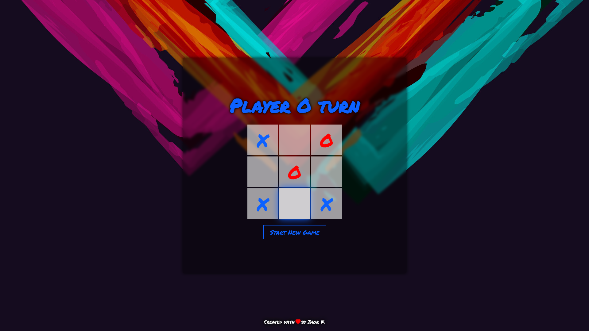

# 💱 Simple Tic Tac Toe Game on React

## ⭐ Demo

The demo website app link -

## ▶️ Installation

To run application from source code locally:

Clone repository

```
git clone https://github.com/Overbist/Learn--Tic-Tac-Toe-Game.git && cd Learn--Tic-Tac-Toe-Game
```

Install dependencies

```
yarn
```

To start app run

```
# Runs the app in the development mode.
yarn start
Open http://localhost:3000 to view it in the browser.
```
